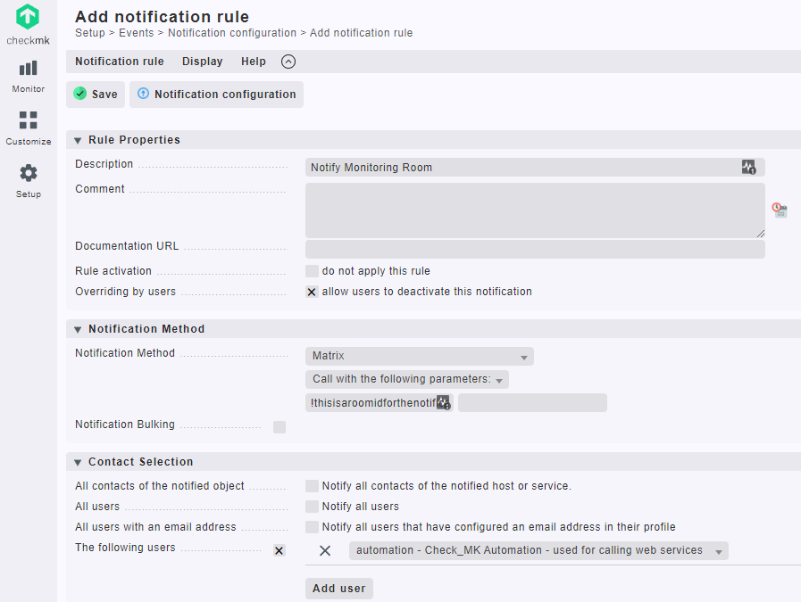
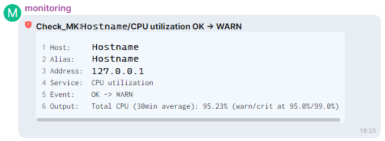

# checkmk-matrix-notify
This script enables the monitoring software Checkmk to send notifications to a [matrix] room.

# Prerequirements
- Create a [matrix] user for your monitoring
- Invite the monitoring user into the rooms you want to notify
- Login to [matrix] with monitoring user and get the access token from Settings > About > Access token

# Install Notification Script
Switch to site user:

``su - mysite``

Install the script into the sites notification scripts folder:

``~/local/share/check_mk/notifications/``

Make script executable:

``chmod +x ~/local/share/check_mk/notifications/checkmk_matrix_notification.py``

Edit script and configure values for MATRIXHOST (your.homeserver.example) and MATRIXTOKEN (The accesstoken you retrieved for your monitoring user):

``edit ~/local/share/check_mk/notifications/checkmk_matrix_notification.py``

# Setup Notification
- Under *Setup > Events > Notification configuration* click *Add rule*
- Insert a description name for the rule and choose notification method *Matrix*
- Set *Call with the following parameters* and enter the room id
- Choose a single user to notify. This can be a dummy user. If multiple users are selected Checkmk will just resend the same message to the same room multiple times

**Only one room id per rule is allowed. To notify multiple rooms just create another notification rule**

Sent notifications then appear in the configured room:

# Credits
The script is mostly a rebuild of the Telegram notification script from stefan+cmk@srcxbox.net with some components from Stanislav N. aka pztrn (https://github.com/bashclub/check_mk_matrix_notifications).